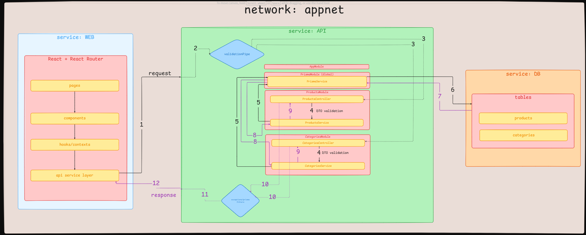

# Product Manager

Aplicação de gerenciamento de produtos com backend em NestJS + Prisma e frontend em React Router.


## Visão geral

Projeto dividido em duas aplicações:

- `product-manager-backend`: API REST com regras de negócio de produtos e categorias.
- `product-manager`: interface web para cadastro, edição, listagem e exclusão.

## Stack

- Backend: NestJS, Prisma, PostgreSQL, class-validator.
- Frontend: React 19, React Router 7, react-hook-form, Tailwind CSS.
- Infra local: Docker Compose (modo dev e modo produção local).

## Estrutura do projeto

```text
.
├─ product-manager/          # frontend
├─ product-manager-backend/  # backend
├─ docker-compose.yml
└─ docker-compose.override.yml
```

## Modelo de domínio

### Category

- `id`
- `name`
- `parentId` (opcional)

### Product

- `id`
- `name`
- `description`
- `price`
- `categoryId`

Cada produto pertence a exatamente uma categoria.

## Regras de negócio implementadas

Backend (services + DTOs) atualmente aplica:

1. Produto deve ter `categoryId` válido (categoria existente).
2. Preço do produto deve ser maior ou igual a zero.
3. Categoria não pode entrar em loop hierárquico (direto ou indireto) ao atualizar `parentId`.
4. Categoria não pode ser removida se tiver subcategorias.
5. Categoria não pode ser removida se tiver produtos vinculados.

## API backend

### Categorias

- `GET /category`
- `GET /category/tree`
- `POST /category`
- `PATCH /category/:id`
- `DELETE /category/:id`

### Produtos

- `GET /product?name=texto`
- `GET /product/:id`
- `POST /product`
- `PATCH /product/:id`
- `DELETE /product/:id`

## Frontend

O frontend foi estruturado para manter a página principal e os formulários com o menor acoplamento possível, preservando legibilidade sem espalhar regra de tela por vários arquivos.

### Objetivo do frontend

- Exibir catálogo de produtos e categorias em uma experiência simples.
- Permitir criação, edição, exclusão e pesquisa.
- Manter a estrutura limpa o bastante para evoluir sem virar uma página monolítica.

### Estrutura de pastas e arquivos

```text
app/
├─ routes/
├─ components/
│  ├─ form/
│  └─ home/
├─ hooks/
├─ context/
├─ lib/
└─ types/
```

Essa separação deixa as rotas responsáveis pela composição das telas, `components` concentrando a UI reutilizável, `hooks` guardando estado e efeitos, `context` centralizando o catálogo, `lib` reunindo funções puras e `types` mantendo os contratos do domínio.

### Decisões técnicas do frontend

- React Router com rotas dedicadas para separar a home dos fluxos de criação e edição.
- Estado de tela e comportamentos derivados extraídos para hooks específicos, deixando os componentes mais próximos de composição do que de regra.
- Primitivas reutilizáveis de formulário para evitar repetição de JSX e padronizar labels, erros e ações.
- Acesso ao catálogo centralizado em contexto para simplificar o consumo de dados entre páginas e componentes.
- Tipos explícitos no domínio para diminuir ambiguidade entre produto, categoria e valores de formulário.
- Componentes pequenos e nomeados para facilitar leitura, revisão e manutenção.

### Manutenibilidade

O frontend foi organizado para favorecer manutenção em quatro pontos:

- Reuso: campos e blocos visuais repetidos extraídos para componentes próprios.
- Isolamento: lógica de consulta, busca e confirmação de exclusão concentrada em hooks.
- Legibilidade: cada arquivo com responsabilidade clara e pequena.
- Evolução: novas telas podem seguir o mesmo padrão sem copiar estruturas antigas.

### Como o frontend se comporta

- A home alterna entre produtos e categorias sem trocar de contexto global.
- A busca é debounced para evitar atualização excessiva enquanto o usuário digita.
- O formulário de produto usa seleção de categoria única (`categoryId`).
- O formulário de categoria reaproveita a mesma base de campo e usa seleção de `parentId`.
- Os dialogs de confirmação evitam exclusão acidental e preservam consistência em ações destrutivas.
- A listagem de categorias no frontend usa `GET /category/tree` e faz flatten da árvore para exibição.

### O que esse frontend privilegia

- Clareza de fluxo em vez de abstração precoce.
- Componentização suficiente para não duplicar estrutura.
- Lógica de tela fora do JSX sempre que isso reduz ruído.
- Contratos TypeScript explícitos entre rotas, hooks e componentes.

## Instalação e execução

### Pré-requisitos

- Node.js 22+
- Docker + Docker Compose

### Ambiente local

1. Instalar dependências:

```bash
cd product-manager-backend
npm install
cd ../product-manager
npm install
```

2. Subir apenas o banco:

```bash
cd ..
docker compose up -d db
```

3. Aplicar migrations e gerar Prisma Client:

```bash
cd product-manager-backend
npx prisma migrate dev
npx prisma generate
```

4. Subir backend:

```bash
cd product-manager-backend
npm run start:dev
```

5. Subir frontend (em outro terminal):

```bash
cd product-manager
npm run dev
```

### Observação de ambiente no frontend local

Se estiver rodando o frontend fora do Docker, configure um dos alvos abaixo:

- `VITE_API_BASE_URL=http://localhost:3000` (chamadas diretas)
- ou `VITE_API_TARGET=http://localhost:3000` (proxy `/api` do Vite)

### Docker (projeto completo)

Na raiz:

```bash
docker compose up -d --build
```

Parar:

```bash
docker compose down
```

## URLs padrão

- Backend: http://localhost:3000
- Frontend: http://localhost:5173

## Testes

Atualmente existem somente testes unitários no backend (controllers e services).

```bash
cd product-manager-backend
npm test
```

## Uso de IA

### IA utilizada

- GitHub Copilot (GPT-5.3-Codex)

### Como a IA ajudou no projeto

- Acelerou o desenvolvimento de configuração de ambiente, padronização inicial e estruturação dos primeiros arquivos.
- Ajudou em trabalhos repetitivos, como refatoração de componentes, extração de hooks, revisão de formulários e limpeza de JSX.
- Foi usada para apoiar a estilização, mantendo consistência visual entre telas, tabelas, formulários e feedbacks.
- Ajudou a organizar mensagens de commit e agrupamentos de refatoração em blocos menores.
- Ajudou também na documentação do projeto, principalmente na organização das seções técnicas e refinamento da forma de apresentar o frontend.
- Ajudou na criação de mensagens de commits semânticas.
- Todo o código gerado ou sugerido pela IA foi revisado manualmente para garantir consistência, integridade e preservação das funcionalidades.

### Em quais partes foi utilizada

- Backend:
	- Setup inicial da estrutura NestJS (módulos, controllers, services, DTOs).
	- Aceleração de regras de negócio em products/categories.
	- Apoio na criação e revisão de testes unitários.
- Frontend:
	- Estruturação de rotas, componentes compartilhados, hooks e contexto.
	- Refatoração de JSX para melhorar composição e legibilidade.
	- Organização de tipagem e integração com API.
- Documentação:
	- Apoio na organização das seções técnicas do README.
	- Revisão de consistência entre texto e implementação.

### Exemplos de prompts usados no backend

1. Investigue por que um produto pode ser salvo sem categoria. Mapeie o fluxo DTO -> service -> Prisma e proponha a menor correção possível sem alterar endpoints.
2. Ajuste `POST /product` para bloquear preço negativo e `categoryId` inválido, mantendo compatibilidade com os endpoints atuais.
3. Revise `CategoriesService` para impedir loops na hierarquia de categorias (direto e indireto) e proponha cobertura de teste unitário.
4. Refatore os testes de `ProductsService` para reduzir duplicação de mocks, mantendo comportamento público.
5. Verifique se os erros de domínio estão retornando códigos HTTP coerentes com filtros globais e exceções do Prisma.

### Exemplos de prompts usados no frontend

1. Identifique quais responsabilidades estão misturadas nesta página React e proponha uma extração mínima para separar estado, handlers e JSX sem alterar o comportamento.
2. Refatore este formulário para reduzir repetição visual, preservar validação e manter o contrato com `react-hook-form` estável.
3. Extraia a lógica de busca, filtro e alternância de visão para um hook específico, mantendo o componente de tela apenas como composição.
4. Simplifique este bloco de tabela para remover handlers inline, preservar acessibilidade e deixar os botões mais fáceis de revisar em code review.
5. Crie um componente reutilizável para campo controlado de seleção, com foco em manter a API simples e reaproveitável entre telas de produto e categoria.
6. Ajuste esta tela para que o JSX final fique mais declarativo, evitando lógica de transformação dentro do render e preservando as mesmas regras de negócio.
7. Organize a estrutura de pastas do frontend para separar rotas, componentes, hooks e helpers, sem quebrar a navegação existente.
8. Ajuste a estilização desta página para melhorar hierarquia visual, mantendo o layout simples e consistente com o restante do app.

### O que foi adaptado manualmente

- Definição e refinamento das regras de negócio no backend.
- Definição do recorte funcional do frontend e revisão da estrutura final de componentes/hooks.
- Ajuste de consistência entre contratos HTTP, services e comportamento de tela.
- Revisão da linguagem da documentação para refletir apenas o que está implementado.

### O que foi corrigido no código sugerido por IA

- Backend:
	- Correções de validações de domínio e fluxo entre controller/service.
	- Ajustes de regras de categoria para evitar inconsistência hierárquica.
	- Correção de divergências entre documentação e modelo real (`categoryId` único no produto).
- Frontend:
	- Remoção de lógica inline desnecessária no JSX.
	- Ajustes de tipagem em formulários e seleções controladas.
	- Correções de composição entre página, hook e componente.
	- Refinamento de estrutura para evitar duplicação entre formulário e tabela.

## Arquitetura

### Estrutura do backend

- `AppModule` atua como módulo raiz.
- `ProductsModule` e `CategoriesModule` encapsulam controllers e services por domínio.
- `PrismaModule` (global) disponibiliza `PrismaService` para acesso ao banco.
- Controllers recebem requisições HTTP e delegam para os services.
- Services concentram regras de negócio e orquestram persistência com Prisma.

### Fluxo de requisição

Fluxo resumido:

`Client (Web) -> API -> ValidationPipe/Filtros -> Controller -> Service -> PrismaService -> PostgreSQL -> resposta`

Descrição:

1. O frontend envia request para os endpoints de produto/categoria.
2. A API passa por validação global (`ValidationPipe`) e filtros de exceção.
3. O controller converte parâmetros (ex.: `ParseIntPipe`) e encaminha ao service.
4. O service aplica regras de negócio (integridade, validações e restrições).
5. O `PrismaService` executa leitura/escrita no PostgreSQL.
6. A resposta retorna ao frontend com payload de sucesso ou erro tratado.

### Organização de módulos

- Organização por domínio (`products`, `categories`) com separação clara entre entrada HTTP e regra de negócio.
- Infraestrutura de banco centralizada em `prisma` para reduzir acoplamento.
- Estrutura compatível com evolução para novos domínios sem quebrar os existentes.

### Diagrama



## Decisões técnicas

### Escolha de ORM

- Prisma foi escolhido por tipagem forte em TypeScript, boa legibilidade das consultas e fluxo de migração previsível.
- O modelo gerado facilita reduzir erros de integração entre código e banco.

### Organização do projeto

- Monorepo simples com duas aplicações: `product-manager-backend` e `product-manager`.
- Backend organizado por domínio (módulos, controllers, services, DTOs).
- Frontend organizado por responsabilidade (rotas, componentes, hooks, contexto, tipos, utilitários).

### Tratamento de erros

- Backend usa `ValidationPipe` global (`whitelist`, `forbidNonWhitelisted`, `transform`).
- Erros de domínio são lançados por exceptions específicas (`BadRequestException`, `NotFoundException`, `ConflictException`).
- Filtros globais padronizam respostas de erro, incluindo tratamento de exceções do Prisma.

### Escalabilidade

- Separação por domínio facilita crescimento do backend sem acoplamento excessivo.
- Regras de negócio concentradas em services tornam manutenção e evolução mais previsíveis.
- Frontend com hooks e componentes reutilizáveis reduz duplicação e custo de mudanças.

### Melhorias recomendadas para produção

- Ampliar cobertura com testes de integração HTTP e e2e reais.
- Adicionar observabilidade (logs estruturados, métricas e tracing).
- Implementar pipeline de CI com gates de lint/test/build.
- Endurecer segurança por ambiente (CORS restritivo, headers, rate limit).
- Evoluir estratégia de deploy e versionamento de migrações para ambientes múltiplos.
